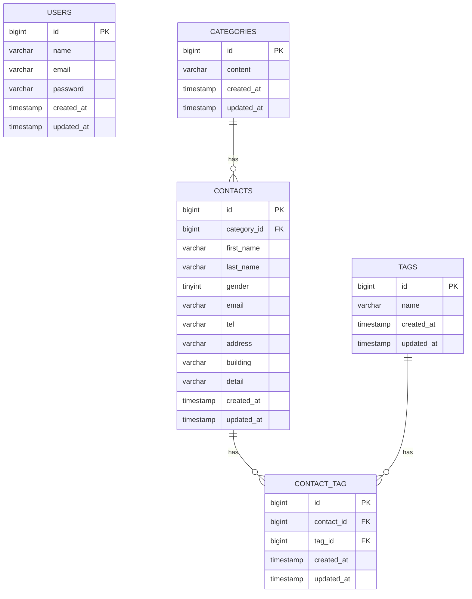

# COACHTECH お問い合わせフォーム

## 概要

誰でもお問い合わせを送信でき、管理者はログイン後、お問い合わせの確認・検索・管理を行えるWebアプリケーションです。

## ER図



## 環境構築

### Dockerビルド

1. リポジトリをクローン

```bash
git clone https://github.com/Laki1413/contact-form-app.git
cd contact-form-app
```

2. PHP依存パッケージをインストール

```bash
docker run --rm \
    -u "$(id -u):$(id -g)" \
    -v "$(pwd):/var/www/html" \
    -w /var/www/html \
    -e COMPOSER_CACHE_DIR=/tmp/composer_cache \
    laravelsail/php82-composer:latest \
    composer install
```

3. `.env` ファイルを作成

```bash
cp .env.example .env
```

`.env` のデータベース設定

```env
DB_CONNECTION=mysql
DB_HOST=mysql
DB_PORT=3306
DB_DATABASE=laravel
DB_USERNAME=sail
DB_PASSWORD=password
```

4. Laravel Sailを起動

```bash
./vendor/bin/sail up -d
```

### Laravel環境構築

1. アプリケーションキーを生成

```bash
./vendor/bin/sail artisan key:generate
```

2. マイグレーションと初期データを実行

```bash
./vendor/bin/sail artisan migrate --seed
```

3. NPMパッケージをインストール

```bash
./vendor/bin/sail npm install
```

4. Vite開発サーバーを起動（起動したまま）

```bash
./vendor/bin/sail npm run dev
```

## 使用技術

- PHP 8.5.5
- Laravel 10.50.3
- MySQL 8.4
- phpMyAdmin
- Docker / Laravel Sail
- Vite
- Tailwind CSS

## APIエンドポイント一覧

| メソッド | エンドポイント               | 概要                   |
| -------- | ---------------------------- | ---------------------- |
| GET      | `/api/v1/contacts`           | お問い合わせ一覧の取得 |
| GET      | `/api/v1/contacts/{contact}` | お問い合わせ詳細の取得 |
| POST     | `/api/v1/contacts`           | お問い合わせの登録     |
| PUT      | `/api/v1/contacts/{contact}` | お問い合わせの更新     |
| DELETE   | `/api/v1/contacts/{contact}` | お問い合わせの削除     |

## 開発環境URL

- アプリケーション：http://localhost/
- phpMyAdmin：http://localhost:8080/

## 作成者

ウォング　愛美
